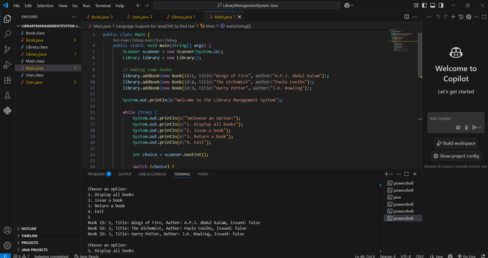

# JavaLibraryConsoleApp

A simple **Library Management System** developed in Java using Object-Oriented Programming (OOP) concepts. This is a console-based application designed for issuing and returning books.

## 📚 Features
- Add books to the library
- Display all available books
- Issue a book by ID
- Return a book by ID

## 🔧 Technologies Used
- Java
- VS Code
- Terminal

## 🧠 OOP Concepts Demonstrated
- Abstraction
- Encapsulation
- Inheritance
- Polymorphism

## 📦 Java Classes
- `Book`: Represents individual book details
- `User`: (Optional) Can be used for future enhancements
- `Library`: Manages the book list and issue/return logic
- `Main`: The main program with user input and menu

  
## ▶️ How to Run

```bash
javac *.java
java Main
```

## 🖼 Sample Output



---

## 👨‍💻 Author  
**Hari Siva Narayana**

🔗 GitHub Repository: [JavaLibraryConsoleApp](https://github.com/Harisivanarayana/JavaLibraryConsoleApp)

---

Thank you for checking out my Java Library Management System! 😊  
Feel free to explore the code, try it out, and suggest improvements.

